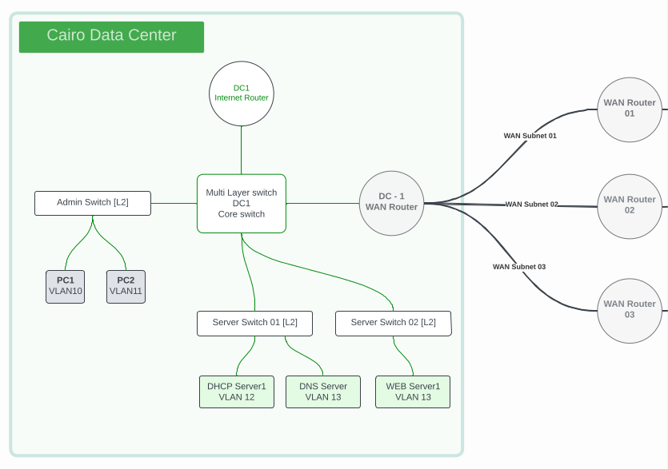
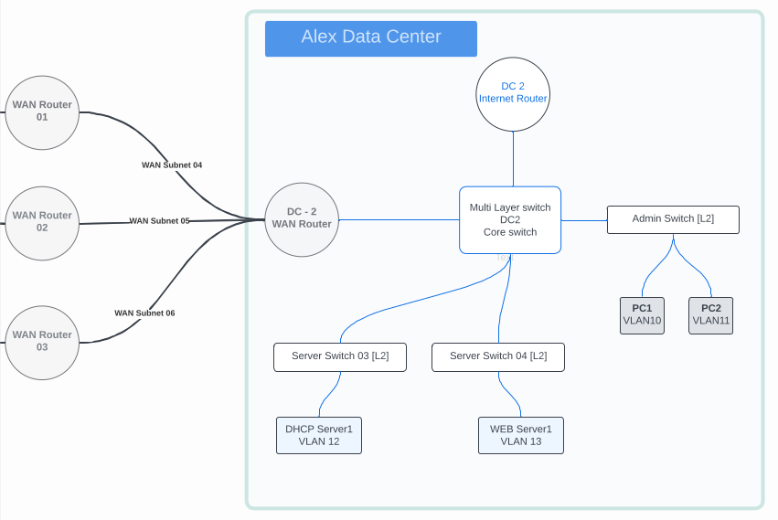

 
# Project details :
> [!NOTE]
> First Study **Case Building** of the two Data Centers For Greenwood Group 

## Case Overview :
  
` I` - Building two Data centers with basic Architecture, demonstrating how these DCs are providing services to their consumers and how the users will be able to consume the offered services.

`II` - Those two Data Centers are Private Data Centers owned by One Enterprise "Greenwood Group" and they have their own WAN Connections to connect both Data Centers.

`III` - Those two Data Center are hosting basic services like **DHCP, DNS and Web servers**, during this phase Admin PCs will be considered as the consumers of the offered Services

`IV` - DHCP of each Data Centers should be serving the local users within the DC, **DHCP01** should be giving IP configurations for **PC01** and **PC02**; and **DHCP02** should be giving IP configurations for **PC03** and **PC04**,**DNS** Server should be serving both Data Centers.

`V` - **WEB Server01** and **WEB Server02** should be accessed via the FQDN from all **PCs 01,02,03 and 04**

`VI` - All PCs should be able to ping each other.

`VII` - All Routing should be only using Static Routes.

`VIII` - WAN IP Ranges **`192.168.10.0/24`** To be used for all WAN Point to Point connections.

`IX` - WAN Routers can be considered as redundant connections with Active/Active/Active or Active/Backup1/Backup2.
## Cairo Data Center Details :
  
IP address Rang ==> **`172.16.0.0/16`**

DHCP Server1 should be in a separate Subnet /26 [IP static configuration]

DNS and Web Server1 should be in a separate Subnet /26 [IP static configuration]

PC01 should be in a separate subnet /25 [Should take IP configuration from DHCP server1]

PC02 should be i a separate subnet /25 [Should take IP configuration from DHCP server1]

PC01 should be able to communicate with PC02

PC01 and PC2 should be able to access WEB server via DNS name FQDN

All gateways has to be configured on the Core switch level

## Alex Data Center Details :

IP address Range ==> **`172.17.0.0/16`**

DHCP Server2 should be in a separate Subnet /26 [IP static configuration]

DNS and Web Server should be in a separate Subnet /26 [IP static configuration]

PC03 should be in a separate subnet /25 [Should take IP configuration from DHCP server2]

PC04 should be i a separate subnet /25 [Should take IP configuration from DHCP server2]

PC03 should be able to communicate with PC04

PC03 should be able to communicate with PC01 and PC02

PC03 should be able to communicate with PC04

PC03 should be able to communicate with PC01 and PC02

All gateways has to be configured on the Core switch level

